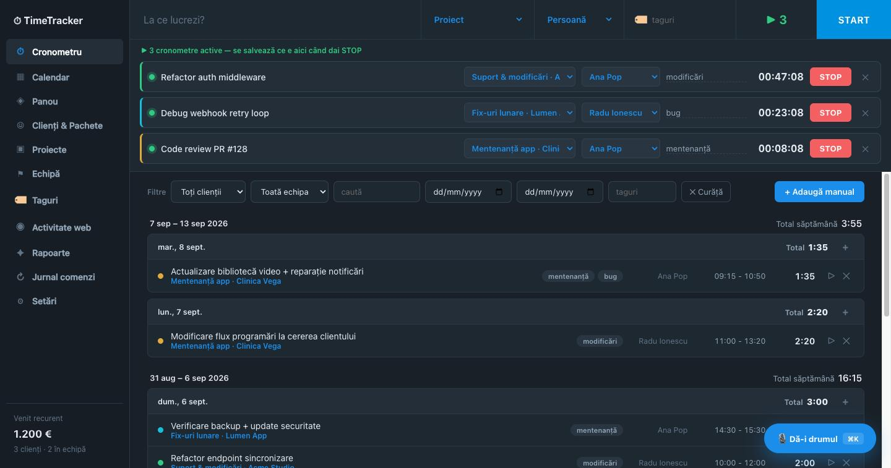
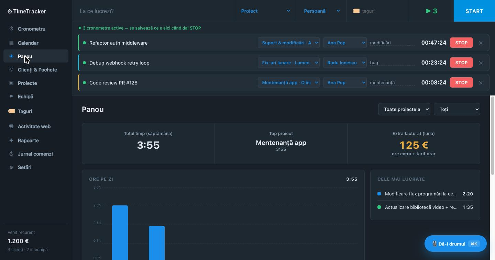
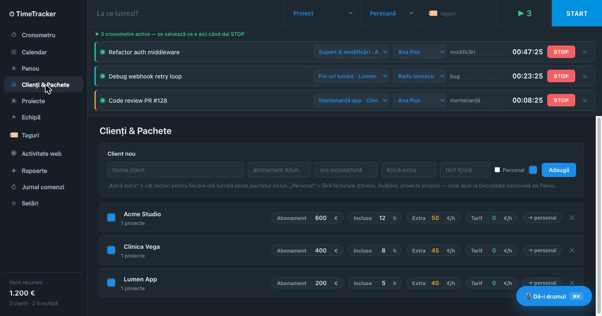
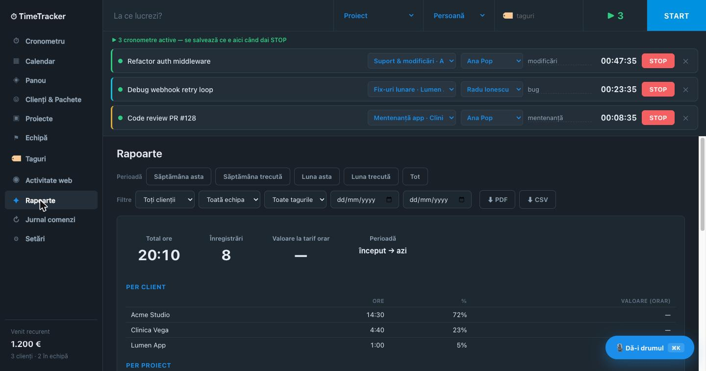
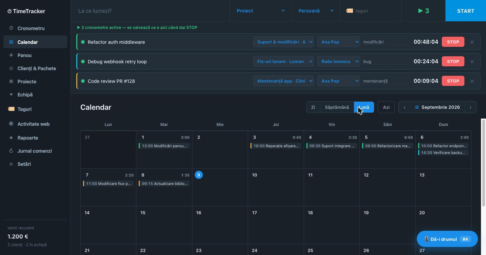
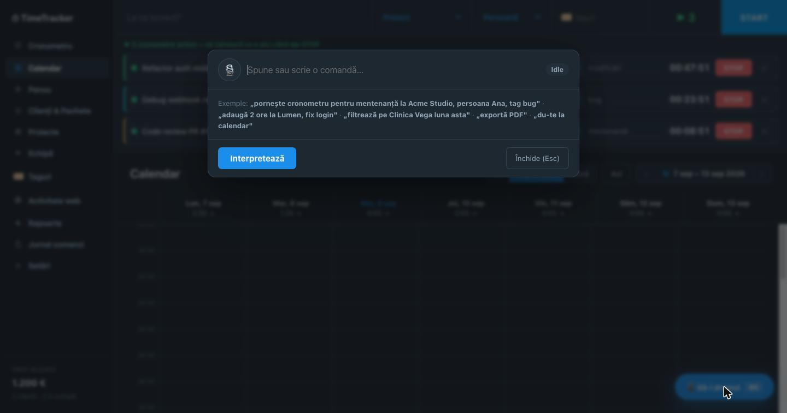
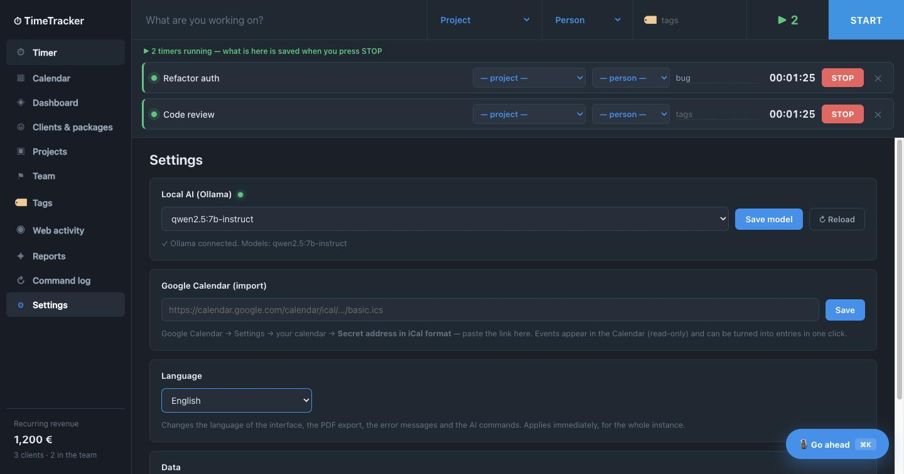

# TimeTracker Pro

**Înlocuitor local, self-hosted, pentru Clockify — făcut pentru cine lucrează la mai multe lucruri deodată.**

Pornești câte cronometre ai contexte. Unul pentru refactor, unul pentru bug-ul în care ai fost tras, unul pentru review-ul pe care îl faci cât rulează build-ul. Fiecare își ține proiectul, persoana și tagurile lui, și fiecare se salvează ca înregistrare separată când îl oprești. Datele stau într-un fișier SQLite pe calculatorul tău, AI-ul rulează local prin Ollama, și nu există cont, cloud sau abonament.

Disponibil în **română, engleză, spaniolă, germană și franceză** — se comută din Setări, fără restart.

<p align="center">
  
</p>

> [Read in English](README.md)

---

## De ce

Clockify, Toggl și Harvest presupun toate un singur cronometru, pentru că au fost gândite pentru cineva care face o treabă pe rând și o facturează. Nu așa arată o bună parte din munca de dezvoltare: pornești ceva, un agent generează în fundal, faci un review, te sună un client, te întorci. La sfârșitul zilei știi că ai muncit, dar tracker-ul are o înregistrare și o aproximare.

TimeTracker Pro presupune fix invers. **Mai multe cronometre simultane sunt comportamentul normal, nu o cârpeală.** Pornești câte unul per context, le oprești pe măsură ce contextele se închid, iar ziua se reconstruiește corect, nu din memorie.

Restul decurge din aceeași idee: să nu coste nimic să-l ții pornit, să meargă fără internet și să nu-ți țină datele ostatice. E un proces Node și un fișier `.db`.

---

## Ce include

| | |
|---|---|
| <br>**Panou** — ore pe zi, top proiect, extra facturat | <br>**Clienți & Pachete** — abonament (€/lună + ore incluse) sau tarif orar |
| <br>**Rapoarte** — pe client, proiect, persoană și tag; export PDF și CSV | <br>**Calendar** — zi / săptămână / lună, lucrări planificate, import Google Calendar |

**Cronometre.** Câte ai nevoie, pornite în același timp. Fiecare are descriere, proiect, persoană și taguri, toate editabile în timp ce merge — STOP salvează ce e curent. Cronometrul persistă peste refresh de browser și peste restart de server.

**Clienți și facturare.** Două modele care pot coexista: abonament (€/lună cu ore incluse și tarif peste pachet) sau tarif orar simplu, setat pe client și suprascriptibil pe proiect. Panoul arată orele consumate față de fiecare pachet.

**Rapoarte și PDF.** Filtrezi după client, persoană, text, interval de date sau taguri — filtrul mișcă împreună panoul, lista de înregistrări, raportul și exportul. PDF-ul e un document brandat cu KPI-uri, consum pe pachet, defalcări pe persoană și pe tag, jurnal complet zi cu zi și, opțional, un rezumat scris de AI.

**Comenzi vocale și text (⌘K).** Scrii sau dictezi *„pornește cronometru pentru mentenanță la Acme Studio, persoana Ana, tag bug"*. Un model local o interpretează, îți arată exact ce a rezolvat (care client, care proiect, care persoană), iar tu confirmi înainte să se scrie ceva.

<p align="center">
  
</p>

Citirile rulează direct; **scrierile cer confirmare vizuală, iar ștergerile confirmare dublă.** AI-ul nu poate apela decât același registry de acțiuni pe care îl folosește și API-ul REST — nu are o cale privilegiată spre bază.

**Activitate web (opțional).** O extensie de browser din `extension/` contorizează timpul pe tab-ul activ din fereastra focusată (idle = pauză) și îl trimite doar către instanța ta locală. Cataloghezi tu fiecare domeniu; nimic nu e etichetat automat și nimic nu pleacă de pe calculator.

**Limbi.** Română, engleză, spaniolă, germană și franceză. Comutarea din Setări schimbă interfața, exportul PDF, mesajele de eroare *și* limba în care AI-ul îți așteaptă comenzile ⌘K — imediat, fără reîncărcare, deci un cronometru pornit continuă să meargă. Datele, numele lunilor și formatarea numerelor urmează locale-ul ales, nu sunt hardcodate.

<p align="center">
  
</p>

Toate textele stau într-un singur fișier, [`shared/locales.json`](shared/locales.json) — serverul îl trimite browserului și îl importă pentru PDF și erori, deci nu există o a doua copie care să rămână în urmă. O limbă nouă înseamnă să-i adaugi codul în `_meta.langs` și să completezi valorile; codul nu se atinge.

**Lucrări planificate.** Bifezi „Planificat" și înregistrarea apare hașurat în calendar, fără să intre la facturare până nu o marchezi ca lucrată. Opțional se repetă săptămânal.

---

## Cum îl rulezi

```bash
npm install
npm start                     # http://localhost:5555
```

Sau în Docker, cum e gândit să meargă zi de zi:

```bash
docker build -t timetracker .
docker run -d --name timetracker --restart unless-stopped \
  -p 127.0.0.1:8888:5555 \
  -v "$PWD/data:/app/data" \
  -e OLLAMA_URL=http://host.docker.internal:11434 \
  timetracker
```

Baza ta de date e un singur fișier, `data/timetracker.db` — **backup înseamnă să copiezi fișierul ăla.** Aplicația scrie și copii cu dată în `data/backups/`.

Ca să-l încerci cu date demo, fără să atingi o bază reală:

```bash
DATA_DIR=/tmp/tt-demo SEED_DEMO=1 PORT=5599 npm start
```

`TT_LANG` setează limba unei instalări **noi** (și a datelor demo) — `TT_LANG=en npm start`. Instanțele existente păstrează ce au salvat, deci un update nu schimbă limba nimănui. După prima pornire, folosești Setările.

### AI local (opțional, gratuit)

1. Instalează [Ollama](https://ollama.com)
2. `ollama pull qwen2.5:7b-instruct` (~4–5 GB, o singură dată)
3. Alegi modelul din **Setări**

Tot ce nu ține de AI merge și fără el. Nu ai nevoie de API key niciodată — modelul rulează la tine, deci comenzile și rapoartele nu costă nimic și nu pleacă nicăieri.

### Dacă îl expui public

Pentru uz local nu are autentificare, intenționat. Dacă îl pui undeva accesibil, setează `APP_PASSWORD` (și opțional `APP_USER`) și va cere login.

---

## Cum e construit

```
server/
  index.js    Fastify — servește UI-ul și API-ul REST
  db.js       SQLite (better-sqlite3, WAL) + schema + seed demo opțional
  actions.js  registry central de acțiuni — singurul care scrie — plus resolver fuzzy
  i18n.js     dicționarul: t(lang, key) și bundle-ul de browser servit la /i18n.js
  ollama.js   AI local: parsare de comenzi cu JSON constrâns, rapoarte streaming
  pdf.js      export PDF (pdfmake, Roboto cu diacritice)
public/       UI vanilla — fără framework, fără build
extension/    extensia de browser pentru activitate web
shared/       locales.json — toate textele către utilizator, în toate limbile
data/         baza ta de date (gitignored)
```

**Stack:** Node 20, Fastify, better-sqlite3, JS vanilla, Ollama, pdfmake. Fără framework, fără pas de build, fără cont cloud.

Regula cea mai importantă: **orice scriere trece prin `actions.js`.** API-ul REST, UI-ul și AI-ul apelează același registry — de aceea AI-ul nu poate face nimic ce nu poate face API-ul, și de aceea orice acțiune ajunge în jurnalul de audit.

Deciziile de arhitectură și UX au fost dezbătute de un consiliu de agenți AI — vezi [DECISION-RECORD.md](./DECISION-RECORD.md).

---

## Contribuții

Issue-urile și pull request-urile sunt binevenite. Direcții utile: limbi noi (adaugi un bloc în `shared/locales.json` — fără schimbări de cod), alte backend-uri de model local, și importatoare din exporturile Clockify/Toggl.

## Licență

MIT — vezi [LICENSE](LICENSE).
